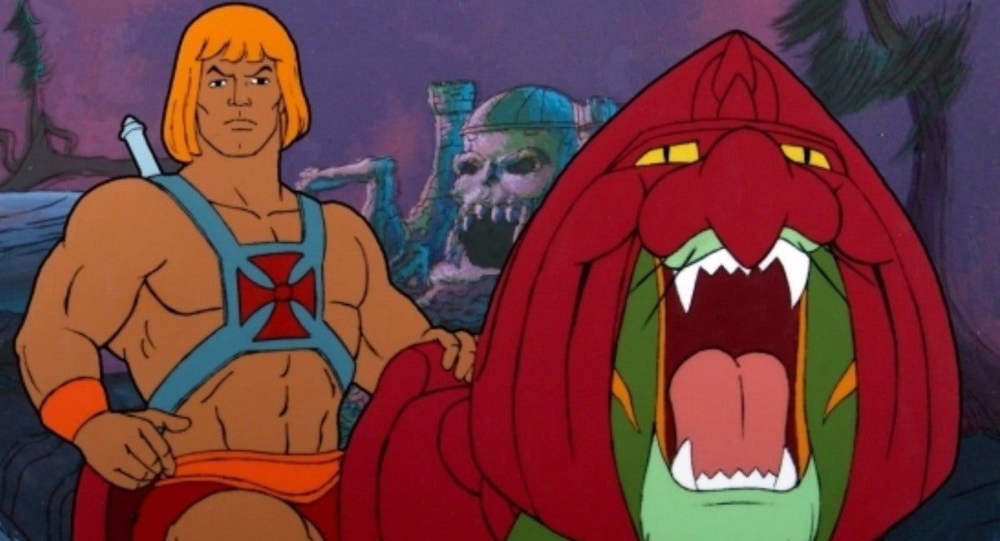

<!DOCTYPE html>
<html lang="fi">
<head>
<meta name="viewport" content="width=device-width, initial-scale=1 shrink-to-fit=no" />
    <!-- Bootstrap CSS -->
    <link rel="stylesheet" href="https://stackpath.bootstrapcdn.com/bootstrap/4.4.1/css/bootstrap.min.css" integrity="sha384-Vkoo8x4CGsO3+Hhxv8T/Q5PaXtkKtu6ug5TOeNV6gBiFeWPGFN9MuhOf23Q9Ifjh" crossorigin="anonymous">
	<link rel="stylesheet" type="text/css" href="styles.css">
	<link rel="icon" href="favicon.png" sizes="16x16" type="image/png">
<meta charset="utf-8" />

<title>Himskun seikkailut</title>
</head>
<body>
<!-- Navigation -->
<nav class="navbar navbar-expand-lg navbar-dark bg-dark static-top">
  

    <h2>HIMSKUN SEIKKAILUT</h2>
    <button class="navbar-toggler" type="button" data-toggle="collapse" data-target="#navbarResponsive" aria-controls="navbarResponsive" aria-expanded="false" aria-label="Toggle navigation">
          
        </button>
    

      <ul class="navbar-nav ml-auto">
        <li class="nav-item active">
          <a class="nav-link" href="indexx.html">Etusivu
                (current)
              </a>
        </li>
        <li class="nav-item">
          <a class="nav-link" href="second.html">Sisältösivu</a>
        </li>
        <li class="nav-item">
          <a class="nav-link" href="third.html">Kuvagalleria</a>
        </li>
      </ul>
    

  

</nav>

    <h1>He-Man oli hassu sarja</h1>

  
1 / 3

  
  
Caption Text

  
2 / 3

  
  
Caption Two

  
3 / 3

  
  
Caption Three

<a class="prev" onclick="plusSlides(-1)">&#10094;</a>
<a class="next" onclick="plusSlides(1)">&#10095;</a>

 

   
   
   

	

	

	

	<h2>Uutinen 1</h2>
	
	
Class aptent taciti sociosqu ad litora torquent per conubia nostra, per inceptos himenaeos. Phasellus id rutrum lectus, et gravida erat. Cras nec urna vestibulum, dictum leo eget, tincidunt sapien. Orci varius natoque penatibus et magnis dis parturient montes, nascetur ridiculus mus. Quisque ultrices facilisis pellentesque. Praesent placerat accumsan ligula, ac tincidunt arcu feugiat a. Aenean vitae hendrerit nunc. Phasellus lacinia nec nisi sit amet elementum. Aenean maximus pulvinar nibh, non placerat mauris lacinia at. Sed molestie augue aliquet elit fringilla, rutrum commodo ex ultrices. Nunc consectetur bibendum quam. Sed orci quam, lobortis a semper vel, scelerisque ut dui. Curabitur eget interdum diam, id molestie nulla. Vivamus tincidunt ante vitae eros efficitur cursus. 

	

	

	<h2>Uutinen 2</h2>
	
	
Lorem ipsum dolor sit amet, consectetur adipiscing elit. Nunc ut nibh quis ex dictum tristique eget a massa. Vivamus ut mi ullamcorper, placerat velit nec, pharetra eros. Phasellus fringilla arcu eget mauris egestas, fermentum rhoncus turpis laoreet. Cras euismod felis non purus gravida, ut imperdiet justo varius. In eget tincidunt quam, quis ultricies ipsum. Mauris tellus arcu, tempor ac urna nec, elementum finibus dolor. Curabitur consequat luctus tortor. Nam aliquam dui sed bibendum pulvinar. Maecenas suscipit tristique enim. In sollicitudin felis ut lobortis ultrices. Integer efficitur felis et velit accumsan, nec suscipit ipsum congue. Maecenas erat mauris, iaculis eget pretium a, lobortis a diam. Morbi vitae arcu faucibus, scelerisque eros sed, bibendum erat. Aliquam erat volutpat. 

	

	

	<h2>Uutinen 3</h2>
	
	
Donec gravida faucibus imperdiet. Donec sagittis pretium lorem eget vehicula. Suspendisse ornare vel nunc eu consequat. Fusce elementum aliquet augue, vitae posuere augue faucibus et. Cras mattis egestas mauris fermentum vestibulum. Integer sit amet velit posuere, iaculis erat quis, scelerisque ante. Cras a sapien et ex luctus maximus. Nunc non sagittis erat, sit amet tristique est. Vestibulum pretium erat non tortor luctus tempus. Praesent sapien ipsum, condimentum sit amet neque ut, faucibus malesuada sapien. Curabitur vehicula venenatis arcu, vel iaculis leo dapibus a. 

	

	

	

    <!-- Optional JavaScript -->
    <!-- jQuery first, then Popper.js, then Bootstrap JS -->
    
    
    
	
	<footer>
	

	
Footerissa

	
on jotain

	
tietoa sivustosta

	

	</footer>
</body>
</html> 