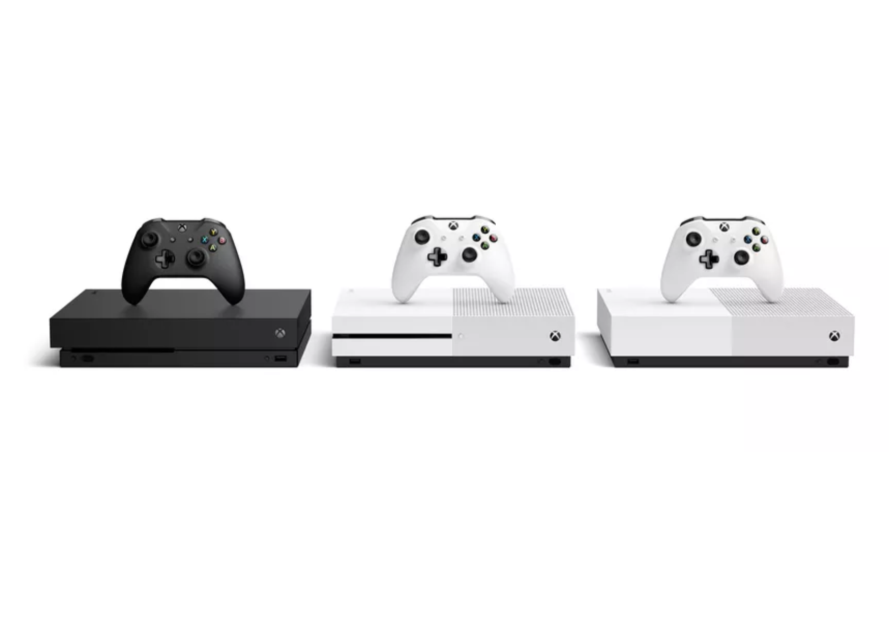

<!DOCTYPE html>
<html lang="fi">
<head>
<meta name="viewport" content="width=device-width, initial-scale=1 shrink-to-fit=no" />
    <!-- Bootstrap CSS -->
    <link rel="stylesheet" href="https://stackpath.bootstrapcdn.com/bootstrap/4.4.1/css/bootstrap.min.css" integrity="sha384-Vkoo8x4CGsO3+Hhxv8T/Q5PaXtkKtu6ug5TOeNV6gBiFeWPGFN9MuhOf23Q9Ifjh" crossorigin="anonymous">
	<link rel="stylesheet" type="text/css" href="styles.css">
	<link rel="icon" href="favicon.png" sizes="16x16" type="image/png">
<meta charset="utf-8" />

<title>XboXed</title>
</head>
<body>
<!-- Navigation -->
<nav class="navbar navbar-expand-lg navbar-dark bg-dark static-top">
  

    <h2>XboXed</h2>
    <button class="navbar-toggler" type="button" data-toggle="collapse" data-target="#navbarResponsive" aria-controls="navbarResponsive" aria-expanded="false" aria-label="Toggle navigation">
          
        </button>
    

      <ul class="navbar-nav ml-auto">
        <li class="nav-item active">
          <a class="nav-link" href="index.html">XboXed
                (current)
              </a>
        </li>
        <li class="nav-item">
          <a class="nav-link" href="ogxbox.html">Xbox</a>
        </li>
        <li class="nav-item">
          <a class="nav-link" href="xbox360.html">Xbox 360</a>
        <li class="nav-item">
          <a class="nav-link" href="xbone.html">Xbox One</a>
        </li>
        <li class="nav-item">
          <a class="nav-link" href="seriesx.html">Xbox Series X</a>
        </li>
        </li>
      </ul>
    

  

</nav>

    <h1>XboXed: an Xbox resource</h1>

  
1 / 4

  
  
Xbox Series X

  
2 / 4

  
  
Xbox One

  
3 / 4

  
  
Xbox 360

  
4 / 4

  
  
Xbox

<a class="prev" onclick="plusSlides(-1)">&#10094;</a>
<a class="next" onclick="plusSlides(1)">&#10095;</a>

 

   
   
  
     

	

	

	

	<h2>Xbox</h2>
	
	
The Xbox is a home video game console and the first installment in the Xbox series of video game consoles manufactured by Microsoft. It was released as Microsoft's first foray into the gaming console market on November 15, 2001, in North America, followed by Australia, Europe and Japan in 2002. It is classified as a sixth generation console, competing with Sony's PlayStation 2 and Nintendo's GameCube. It was also the first major console produced by an American company since the Atari Jaguar ceased production in 1996.

	

	

	<h2>Xbox 360</h2>
	
	
The Xbox 360 is a home video game console developed by Microsoft. As the successor to the original Xbox, it is the second console in the Xbox series. It competed with Sony's PlayStation 3 and Nintendo's Wii as part of the seventh generation of video game consoles. It was officially unveiled on MTV on May 12, 2005, with detailed launch and game information announced later that month at the 2005 Electronic Entertainment Expo.

	

	

	<h2>Xbox One</h2>
	
	
The Xbox One is an eighth-generation home video game console developed by Microsoft. Announced in May 2013, it is the successor to Xbox 360 and the third console in the Xbox series of video game consoles. It was first released in North America, parts of Europe, Australia, and South America in November 2013, and in Japan, China, and other European countries in September 2014. It is the first Xbox game console to be released in China, specifically in the Shanghai Free-Trade Zone. Microsoft marketed the device as an "all-in-one entertainment system", hence the name 'Xbox One'. The Xbox One mainly competes against Sony's PlayStation 4 and Nintendo's Wii U and Switch.

	

	

	

    <!-- Optional JavaScript -->
    <!-- jQuery first, then Popper.js, then Bootstrap JS -->
    
    
    

</body>
</html> 